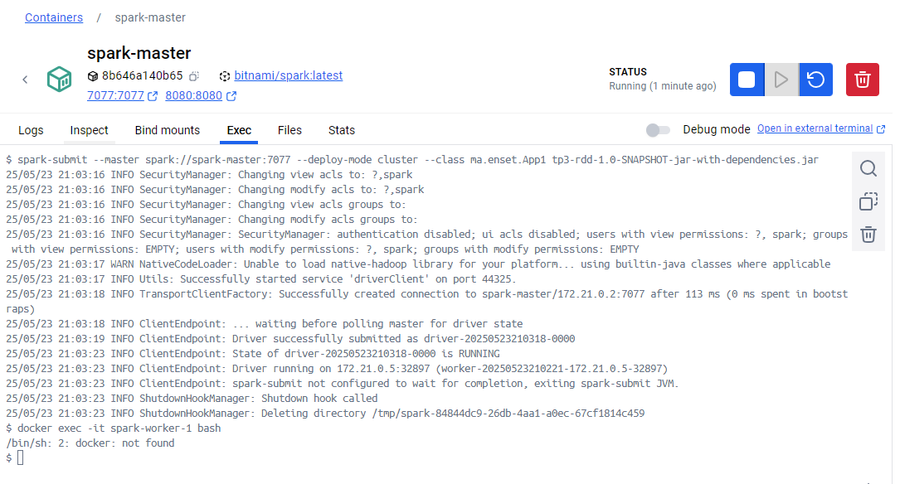

<h2>TP: Traitement parallèle et distribué avec Spark</h2>
<h3>Exercice 1 :</h3>
<h5>1.le total des ventes par ville :</h5>
<h6>1.1.Testez de code en local</h6>

<h6>1.2.Lancement de job sur le cluster.</h6>
<h6>Commande executer</h6>

1/Copier le fichier JAR vers le Spark Master:

<h6>docker cp .\tp3-rdd-1.0-SNAPSHOT-jar-with-dependencies.jar spark-master:/opt/bitnami/spark</h6>

 2/ Soumettre l'application au cluster :

<h6>spark-submit --master spark://spark-master:7077 --deploy-mode cluster --class ma.enset.App1 tp3-rdd-1.0-SNAPSHOT-jar-with-dependencies.</h6>

<h4>2.Application permettant de calculer le prix total des ventes des produits par ville et par année :</h4>
